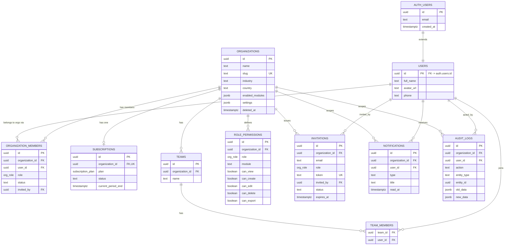

# Database Relationship Diagram — Phase 1

Rendered as Mermaid ER notation — pastes directly into any Mermaid-compatible viewer (GitHub, Notion, the docs site). Represents the multi-tenant foundation only; each future phase adds its own entity cluster hanging off `organizations` via the same `organization_id` pattern shown here.



## Reading Notes

- **`organizations` is the tenancy root.** Every other table either hangs off it directly (`organization_id` FK) or reaches it transitively (`team_members` → `teams` → `organizations`). This is the shape every future phase's tables (customers, products, invoices, employees, etc.) will follow — a new domain table is always one hop from `organizations`.
- **`auth.users` vs `users`** is a deliberate split: `auth.users` is Supabase-managed (never touched directly by application code, holds credentials), `users` is our extensible profile table (1:1, created automatically via trigger on signup). Future profile fields (job title, preferred language, timezone) extend `users`, never `auth.users`.
- **`organization_members` is the multi-tenancy join table** — a `users` row with zero `organization_members` rows is a signed-up-but-not-onboarded user; one with several is a user serving multiple businesses (e.g., an accountant), each with a potentially different role.
- **`role_permissions` is per-organization**, not global — an org can customize what "Manager" means for them without affecting any other tenant, which is what makes custom roles (Blueprint Section 6) possible without a schema change.
- **`audit_logs.organization_id` is nullable** deliberately — some auditable actions (e.g., a platform-level admin action) may not be organization-scoped; this is the one intentional exception to "every table has a non-null organization_id."

## Future Phase Extension Pattern (for reference, not built yet)

```
ORGANIZATIONS ||--o{ CUSTOMERS : "Phase 2"
ORGANIZATIONS ||--o{ PRODUCTS : "Phase 2"
ORGANIZATIONS ||--o{ ORDERS : "Phase 2"
ORGANIZATIONS ||--o{ INVOICES : "Phase 3"
ORGANIZATIONS ||--o{ EMPLOYEES : "Phase 3"
ORGANIZATIONS ||--o{ PAYROLL : "Phase 3"
ORGANIZATIONS ||--o{ WORKFLOWS : "Phase 4"
```
Every one of these follows the identical `organization_id` FK + RLS-via-`user_org_ids()` + `role_permissions` module entry pattern established in Phase 1 — no new architectural pattern is introduced by later phases, only new tables using this one.
